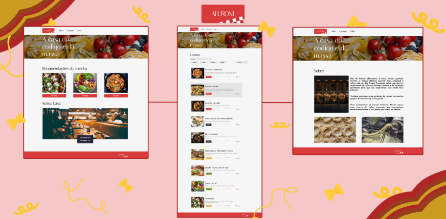

<h1></img></h1>

Projeto criado para um aula de React da Alura, o foco principal era usar as bibliotecas Typescript e Router.

O objetivo era criarmos uma página para um restaurante fictício chamado Aluroni, fizemos uma pagina de inicio, uma para o cardápio que redireciona para uma baba de pratos e também acrescentamos uma página de sobre e outra de NotFound.

### Observações

Publiquei o projeto no git pages, mas infelizmente por ter que subir como um arquivo build, a página NotFound não aparece, pois o pages lê a uma página HTML e por isso não podemos navegar nele usando a URL. Para que a página funcione é só baixar o projeto e iniciar com "npm start".

## Imagens do site

Nas imagem a seguir estão as três telas principais do site que são, início, cardápio e sobre

</img>

*Nas telas de início e cardápio os ao clicar nos pratos ou em "Ver mais" você será redirecionado para uma página onde estarão todas as informações detalhadas do prato*

</img>
